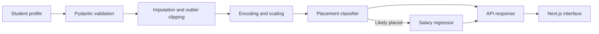

# Skill Bridge

**Placement intelligence for engineering students.**

Skill Bridge is a full-stack machine learning application that turns a student's academic,
skills, lifestyle, and background profile into two practical estimates: placement probability
and, when placement is predicted, an expected salary range in lakhs per annum (LPA).

It pairs reproducible scikit-learn pipelines with a typed FastAPI backend and a responsive
Next.js interface.

## What it provides

- Placement probability, outcome, and confidence label for an individual profile
- Conditional salary prediction with an RMSE-based range
- Batch inference for 1–100 student profiles
- Strict Pydantic validation for all 22 input fields
- Interactive Swagger documentation at `/docs`
- Reproducible training from the included student datasets

## Model snapshot

The committed artifacts were trained on 5,000 student records. Salary regression uses the
4,303 records labelled `Placed`. `Student_ID` joins the feature and target files but is never
passed to either model.

| Prediction task | Algorithm | Evaluation set | Results |
| --- | --- | --- | --- |
| Placement likelihood | Logistic Regression | Stratified 15% test split across all 5,000 profiles | ROC-AUC **0.9058** · Accuracy **83.07%** · F1 **0.8943** |
| Salary estimate | Ridge Regression | 15% test split across the 4,303 profiles labelled `Placed` | R² **0.7743** · RMSE **1.4114 LPA** · MAE **1.1435 LPA** |

ROC-AUC measures ranking quality across placement thresholds, accuracy is the share of
correct placement outcomes, and F1 balances precision with recall. For salary, R² describes
explained variance while RMSE and MAE show the typical prediction error in LPA; lower error
is better.

The metrics are recorded in [`models/metadata.json`](models/metadata.json). Predictions are
estimates based on the supplied dataset, not hiring decisions or placement guarantees.

## How it works



Each saved scikit-learn pipeline owns its preprocessing. Imputation, IQR-based clipping,
categorical encoding, and scaling are fitted on training data and reused unchanged at
inference time.

## Tech stack

- **Machine learning:** Python, pandas, NumPy, scikit-learn, joblib
- **Backend:** FastAPI, Pydantic, Uvicorn
- **Frontend:** Next.js 16, React 19, TypeScript, Tailwind CSS
- **Validation:** pytest, Ruff, TypeScript type checking

## Project structure

```text
skill-bridge/
├── data/                    # Feature and target CSV files
├── models/                  # Trained pipelines and evaluation metadata
├── src/skill_bridge/
│   ├── preprocessing.py     # Feature groups and sklearn transformers
│   ├── training.py          # Training, evaluation, and artifact export
│   ├── predictor.py         # Inference interface
│   ├── schemas.py           # Request and response validation
│   └── api.py               # FastAPI application and endpoints
├── tests/                   # Predictor and API contract tests
├── frontend/                # Next.js prediction interface
└── render.yaml              # Backend deployment definition
```

## Run locally

### 1. Start the API

Python 3.11–3.14 is recommended. From the repository root:

```bash
python -m venv .venv
# macOS/Linux
source .venv/bin/activate
# Windows PowerShell
.venv\Scripts\Activate.ps1

pip install fastapi uvicorn pydantic pandas numpy scikit-learn joblib pytest ruff
```

Start the backend with the `src/` directory on the Python path:

```bash
# macOS/Linux
PYTHONPATH=src uvicorn skill_bridge.api:app --reload --port 8000

# Windows PowerShell
$env:PYTHONPATH = "src"
uvicorn skill_bridge.api:app --reload --port 8000
```

Open `/docs` on the running API for Swagger UI.

### 2. Start the web app

In a second terminal:

```bash
cd frontend
npm ci
Copy-Item .env.example .env.local  # Windows PowerShell
# macOS/Linux: cp .env.example .env.local
npm run dev
```

Open the development URL printed by the Next.js server once it is ready.

## Configuration

| Variable | Default | Purpose |
| --- | --- | --- |
| `MODEL_DIR` | `models` | Location of the classifier, regressor, and metadata |
| `ALLOWED_ORIGINS` | Development frontend origin | Comma-separated origins allowed by CORS |
| `NEXT_PUBLIC_API_URL` | Running API origin | API base URL used by the frontend |


## API surface

| Method | Endpoint | Purpose |
| --- | --- | --- |
| `GET` | `/` | Service name and useful links |
| `GET` | `/health` | Confirm that model artifacts are loaded |
| `GET` | `/model/info` | Return model metadata and evaluation metrics |
| `POST` | `/predict` | Placement result plus conditional salary result |
| `POST` | `/predict/placement` | Placement result only |
| `POST` | `/predict/salary` | Salary estimate for a valid profile |
| `POST` | `/predict/batch` | Predict 1–100 profiles |

## Retrain the models

With the backend dependencies installed and `PYTHONPATH=src` configured, run:

```bash
python -m skill_bridge.training
```

Training joins both CSV files on `Student_ID`, recreates deterministic 70/15/15 splits with
random seed `42`, evaluates the held-out partitions, and refreshes the three files in
`models/`.

## Verify changes

```bash
ruff check src tests
pytest

cd frontend
npm run typecheck
npm run build
```

## Deployment

[`render.yaml`](render.yaml) defines the FastAPI service and its `/health` check. Set
`ALLOWED_ORIGINS` to the deployed frontend origin, deploy `frontend/` to a Next.js-compatible
host, and set `NEXT_PUBLIC_API_URL` to the public API URL.

Before deploying the current Render configuration, make sure the backend has installable
packaging metadata for its `pip install .` build command and that the `src/` layout is exposed
to the application process.
